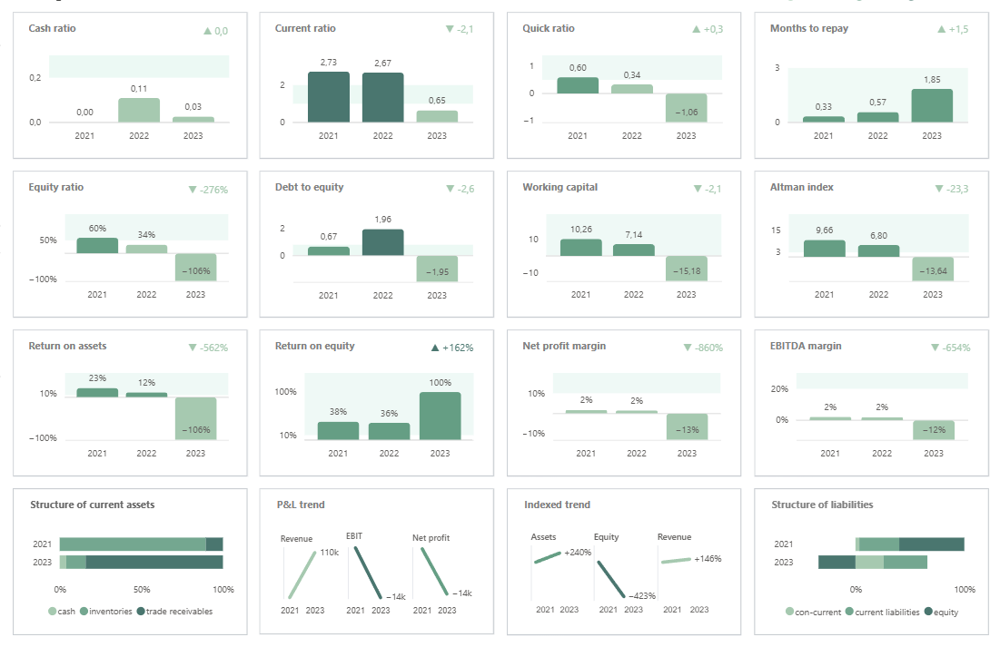

# Integra LLC — Financial Health Dashboard (Power BI)

A product-style, reproducible **financial health dashboard** for a mid-sized company (2021–2023).  
The report tracks **12 core KPIs** with YoY deltas, target norms, and risk flags, plus structural and trend views (assets, liabilities, and P&L).

**Live page:** https://irinatok11.github.io/fin-health-power-bi/ · **Repo:** https://github.com/IrinaTok11/fin-health-power-bi

---

## Table of contents
- [Overview](#overview)
- [Key features](#key-features)
- [Design variants (two pages)](#design-variants-two-pages)
- [Data model (at a glance)](#data-model-at-a-glance)
- [KPIs tracked](#kpis-tracked)
- [Per-KPI trend badge](#per-kpi-trend-badge)
- [Screenshots](#screenshots)
- [Project structure](#project-structure)
- [Getting started](#getting-started)
- [Methodology (how it works)](#methodology-how-it-works)
- [Data & privacy](#data--privacy)
- [Cross-workflow usage](#cross-workflow-usage)
- [Roadmap](#roadmap)
- [License](#license)
- [Contact](#contact)

---

## Overview
**Goal:** provide a clear, decision-ready view of the company’s financial condition across **12 ratios** with YoY deltas, norms, and flags.  
**Audience:** executives, finance leads, and analysts.  
**Tech stack:** Power BI Desktop · DAX (comma arguments) · Deneb (Vega-Lite JSON) · Excel.

---

## Key features
- **One-screen health check** with traffic-light logic and concise commentary.
- **Norm bands per KPI** (soft ranges with a neutral zone) used on **all 12 KPI cards**.
- **YoY deltas** (absolute/relative), directional arrows, formatted tooltips.
- **Per-KPI trend badge** (top-right of each card): arrow + color by current norm status.
- **Consistent visual language**: theme, typography, color scale for “above / at / below norm”.
- **Reproducible setup**: versioned DAX, Deneb specs, and data dictionary.

---

## Design variants (two pages)
- **Page 1 — v1 (rounded cards):** live, presentation-style dashboard with rounded corners and soft background (web look).
- **Page 2 — v2 (flat cards, print-friendly):** same data and measures, but a flat visual style optimised for clean Word screenshots.  
  
> v1 and v2 use the **same** numbers; v2 only changes styling to paste visuals cleanly into Word.

---

## Data model (at a glance)
- **Tables:**  
  `financials_long` (fact: yearly values) · `ratios` (KPI aggregates & measures) · `years` (helper) · `palette` (theme) · `Sections` (UI helpers).
- **Relationships:** star-style around `financials_long[Year]` (one-to-many with `years`).
- **Measures location:** stored under table **ratios** and versioned in [`/dax`](./dax).
- **Definitions & norms:** kept in [`/docs/kpi_catalog.md`](./docs/kpi_catalog.md) with detailed logic in [`/docs/methodology.md`](./docs/methodology.md).

---

## KPIs tracked
### 1) Liquidity
- Cash ratio
- Current ratio
- Quick ratio
- Months to repay (liquidity coverage in months)

### 2) Capital structure & solvency
- Equity ratio (Autonomy)
- Debt to equity
- Working capital (absolute)
- Altman Index

### 3) Profitability & returns
- Return on assets (ROA)
- Return on equity (ROE)
- Net profit margin
- EBITDA margin

### 4) Structure & trends
- Structure of current assets (cash, inventories, trade receivables)
- P&L trends (Revenue, EBIT, Net Profit)
- Indexed trends (Assets, Equity, Revenue)
- Structure of liabilities (current liabilities, non-current liabilities, equity)

---

## Per-KPI trend badge
Every KPI card includes a small **trend badge** in the top-right corner.  
The badge communicates both **direction** (YoY change) and **quality vs norm** (color):

- **Arrow:** ▲ positive YoY change, ▼ negative, ● no change.  
- **Color:** follows the KPI’s **current norm status** (`below / at_norm / above` → color hex).  
  So you see at a glance: *is it improving and is it within norm?*

**Visual type:** native Power BI **Card**.

**Measures used (see `dax/`):**
- `YoY Δ` / `YoY Delta %` — latest year vs previous year (numeric or %)
- `Trend Arrow` — ▲ / ▼ / ● based on the sign of `YoY Δ`
- `Trend Chip Text` — formatted label (e.g., `▲ +2.1` or `▼ −13%`)
- `Norm Status` → `Color Hex` — color taken from the KPI’s current status  
- (optional) blank-handling to hide the badge if the previous year is missing

---

## Screenshots
**Page 1 — v1 (rounded cards)**  

**Page 2 — v2 (flat cards, print-friendly)**  

---

## Project structure
~~~text
.
├─ assets/                # screenshots used in README
├─ data/                  # sample/anonymized Excel (e.g., integra_financial_analysis.xlsx)
├─ dax/                   # DAX measures (one file per measure or grouped)
├─ deneb/                 # Vega-Lite specs for Deneb visuals (reproducible JSON)
│  ├─ kpi_bars_numeric.vl.json
│  ├─ kpi_bars_percent.vl.json
│  ├─ legend_status.vl.json
│  ├─ row_labels.vl.json
│  ├─ trend_indexed.vl.json
│  └─ trend_pnl.vl.json
├─ docs/                  # GitHub Pages landing (Cayman theme)
│  ├─ _config.yml
│  ├─ cover.png
│  ├─ cover2.png
│  ├─ index.md
│  └─ methodology.md
├─ fin-health.pbix        # Power BI report (root)
├─ LICENSE
├─ PROJECT_NOTES.md
└─ README.md              # this file
~~~

---

## Getting started

### Prerequisites
- Power BI Desktop (tested on 2.146.705.0 64 (August 2025), Windows).
- Optional: Deneb custom visual (Marketplace → “Deneb”).

### Open the report
1. `git clone https://github.com/IrinaTok11/fin-health-power-bi`
2. Open **fin-health.pbix** from the repo root.
3. If prompted, set the Excel path to `data/integra_financial_analysis.xlsx`.
4. Apply the theme: **View → Themes → Browse → `themes/powerbi_theme.json`**.
5. **Refresh** to recalculate all measures and visuals.

---

## Methodology (how it works)
- **Norm bands.** Each KPI has a target range (`Norm Low`, `Norm High`). In-band = neutral; out-of-band = flagged.
- **Directionality.** “Better is higher” vs “better is lower” handled explicitly; buckets: `above` / `at_norm` / `below`.
- **YoY deltas.** Measures compute absolute change and formatted strings with ▲/▼ arrows; blanks handled defensively.
- **DAX style.** Comma-separated arguments, consistent naming (`grp__KPI__SubKPI__MeasureName`).
- **Deneb.** Clean Vega-Lite JSON (no `//` or `/* */`). Legends and rationale described in `docs/methodology.md`.

See:
- `docs/kpi_catalog.md` — formulas & interpretation  
- `docs/methodology.md` — modelling & visual rules  
- `docs/data_dictionary.md` — fields and types

---

## Data & privacy
- Ships with **anonymized/sample** data (`data/`).
- Replace sample files locally if needed; keep raw identifiers and sensitive fields **out of version control**.

---

## Cross-project usage
- **Page 2 — v2 (flat)** provides clean screenshots for the Word section **“3.2 Analysis of liquidity ratios”** generated by the companion **Python** project.  
  Python portfolio: **live** https://irinatok11.github.io/fin-health-python/ · **repo** https://github.com/IrinaTok11/fin-health-python

---

## Roadmap
- Sector benchmarks (peer table, quartiles).
- DuPont decomposition of ROE.
- Scenario & sensitivity (revenue growth, COGS, WACC).
- Export: **reports/Executive_Summary.pdf** (1–2 pages for leadership).

---

## License
This project is available under the **MIT License**. See [LICENSE](LICENSE).

---

## Contact
**IRINA TOKMIANINA** — Financial/BI Analyst  
LinkedIn: [linkedin.com/in/tokmianina](https://www.linkedin.com/in/tokmianina/) · Email: <irinatokmianina@gmail.com>
